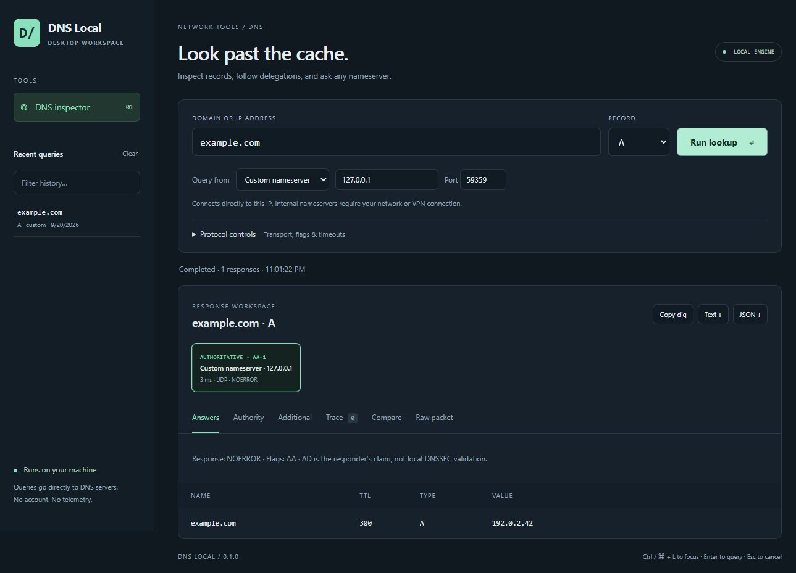

# DNS Local

A desktop DNS inspector that sends queries from your own machine. Ask an internal nameserver, inspect a delegation from the root, or compare a zone's authoritative answer with public resolver caches.



Version 0.1.0 is an unsigned Windows x64 **preview**. See [release notes](docs/RELEASE_NOTES_0.1.0.md) and the [upload checklist](docs/UPLOAD_CHECKLIST.md).

## Run

Download `DNS Local 0.1.0.exe` and `SHA256SUMS.txt` from the GitHub Releases page, verify the checksum, and run the executable. No Node.js installation is required for the packaged build. The Windows x64 release is intentionally unsigned for now. Windows may display an "Unknown publisher" or "Windows protected your PC" warning, and managed devices may block it. Signing is not required to publish the source repository. See [distribution notes](docs/DISTRIBUTION.md). macOS and Linux packages can be built on their native platforms using the release workflow.

To run from source, install Node.js 22.12 or later and open a terminal in the repository root:

```sh
npm ci
npm start
```

This repository is self-contained. The engine package lives in `packages/dns-core` and is installed as a local dependency. `npm start` compiles the engine before launching.

## Included in 0.1

- System, public, and custom IPv4/IPv6 nameservers; custom port for local/VPN DNS.
- Direct authoritative queries and an iterative root-to-zone delegation trace.
- One responding authority compared against Google, Cloudflare, Quad9, and OpenDNS.
- UDP with automatic TCP fallback on truncation, or TCP-only queries.
- Per-attempt timeout, retries, EDNS buffer, RD/CD/DO flags, a 60-second operation limit, and cancellation.
- A, AAAA, CNAME, MX, TXT, NS, SOA, PTR, CAA, SRV, DS, DNSKEY, RRSIG; DMARC, DKIM, SPF query helpers.
- SPF searches show only SPF policy records in Answers and Compare; ordinary TXT searches show all TXT records. Raw packet data remains complete for inspection.
- Answer, authority, additional, trace, comparison, and decoded/raw-wire views.
- Searchable local query history (200 entries), clear history, JSON/text exports, and reproducible `dig` commands.

Authority labels reflect the **AA flag in the responding packet**. A recursive resolver answer is never labeled authoritative merely because it came from a public DNS provider. AD is the resolver's claim; this app does **not** validate the DNSSEC chain locally.

## Limits and interpretation

- Direct DNS requires outbound UDP/TCP port 53. Corporate networks can block direct root/authoritative access even when the system resolver works.
- Authority mode shows the first usable authoritative server, not a consensus of every server in the zone. CNAME target chasing is not performed by the iterative walker.
- The walker checks advancing referrals and only trusts in-bailiwick glue. Nameserver address queries without usable glue are independently walked from the roots. Dependencies are bounded by depth, hop, query, and time limits. Four IPv4 root hints are bundled; IPv6-only root bootstrap is not supported yet.
- System mode queries Node's configured DNS server list; it is not the OS stub resolver. Hosts files and per-domain OS/VPN routing rules may behave differently. Use Custom for a particular split-DNS server.
- Comparison ignores TTL and order. Differences can arise from caching, split DNS, geography, load balancing, or policy. They do not prove propagation lag.
- DNSSEC chain validation, watch mode, saved profiles, and a CLI remain future work.
- Windows is the locally built/tested distribution. Native CI jobs prepare Linux and macOS artifacts; signing and notarization require the project owner's credentials.

## Privacy

No accounts, telemetry, ads, analytics, or automatic update checks. DNS requests leave the machine for the selected nameserver; trace/authority operations additionally contact root and delegated nameservers, and comparison contacts the four listed public resolvers. There are no application backend requests. The renderer has no network access or Node privileges.

History stores the request and time, not full responses, in Electron's `userData/history.json`: `%APPDATA%/dns-local/` on Windows, `~/Library/Application Support/dns-local/` on macOS, and `$XDG_CONFIG_HOME/dns-local/` (normally `~/.config/dns-local/`) on Linux. Packaged product naming may use `DNS Local` in place of `dns-local`. Use **Clear** to remove entries. Exports are saved only where you choose.

## Development

```sh
npm run typecheck
npm run lint
npm test
npm run dist
```

The UI is static HTML/CSS/JavaScript. A sandboxed Electron renderer talks to a narrow preload API; raw sockets and file operations live in the main process. Network data is rendered using `textContent`, and IPC sender/frame checks prevent calls from foreign pages. See [Electron's security guidance](https://www.electronjs.org/docs/latest/tutorial/security).

`@dns-search/core` contains query preparation, record normalizers, IP/PTR handling, resolver definitions and DoH transport. The desktop application supplies UDP/TCP transports, delegation tracing, local state, and the interface. All required source is included in this repository.

MIT licensed. See [CONTRIBUTING.md](CONTRIBUTING.md).

See [platform testing and signing](docs/PLATFORM_TESTING.md) for separate OS build commands and the expanded GUI regression suite.

## Repository and release files

Commit the source, package lockfile, documentation, tests, licenses, and `.github` workflows. Installed dependencies, generated engine output, test profiles, and packaged binaries are excluded by `.gitignore`. Recreate dependencies with `npm ci` and builds with the documented commands.

Packaged executables belong in GitHub Releases rather than Git history. Attach the Windows executable and its checksum as release assets. No repository URL is hardcoded.
